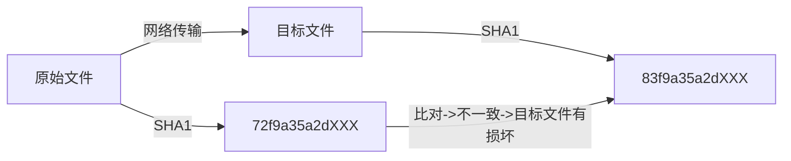

<!-- TOC -->

- [Git&GitHub](#gitgithub)
    - [1 版本控制工具应该具备的功能](#1-版本控制工具应该具备的功能)
    - [2 版本控制简介](#2-版本控制简介)
        - [2.1 版本控制](#21-版本控制)
        - [2.2 版本控制工具](#22-版本控制工具)
    - [3 Git简介](#3-git简介)
        - [3.1 Git 简史](#31-git-简史)
        - [3.2 Git 官网和 Logo 官网地址:https://git-scm.com/](#32-git-官网和-logo-官网地址httpsgit-scmcom)
        - [3.3 Git 的优势](#33-git-的优势)
        - [3.4 Git 安装](#34-git-安装)
        - [3.5 Git 结构](#35-git-结构)
        - [3.6 Git 和代码托管中心](#36-git-和代码托管中心)
        - [3.7 本地库和远程库](#37-本地库和远程库)
            - [3.7.1 团队内部协作](#371-团队内部协作)
            - [3.7.2 跨团队协作](#372-跨团队协作)
    - [4 Git命令行操作](#4-git命令行操作)
        - [4.1 本地库初始化](#41-本地库初始化)
        - [4.2 设置签名](#42-设置签名)
        - [4.3 基本操作](#43-基本操作)
            - [4.3.1 状态查看](#431-状态查看)
            - [4.3.2 添加](#432-添加)
            - [4.3.3 提交](#433-提交)
            - [4.3.4 查看历史记录](#434-查看历史记录)
            - [4.3.5 前进后退](#435-前进后退)
            - [4.3.6 reset 命令的三个参数对比](#436-reset-命令的三个参数对比)
            - [4.3.7 删除文件并找回](#437-删除文件并找回)
            - [4.3.8 比较文件差异](#438-比较文件差异)
        - [4.4 分支管理](#44-分支管理)
            - [4.4.1 什么是分支?](#441-什么是分支)
            - [4.4.2 分支的好处?](#442-分支的好处)
            - [4.4.3 分支操作](#443-分支操作)
    - [5 Git基本原理](#5-git基本原理)
        - [5.1 哈希](#51-哈希)
        - [5.2 Git 保存版本的机制](#52-git-保存版本的机制)
            - [5.2.1 集中式版本控制工具的文件管理机制](#521-集中式版本控制工具的文件管理机制)

<!-- /TOC -->
#Git&GitHub

##1 版本控制工具应该具备的功能
     协同修改
        多人并行不悖的修改服务器端的同一个文件。
     数据备份
        不仅保存目录和文件的当前状态，还能够保存每一个提交过的历史状态。
     版本管理
        在保存每一个版本的文件信息的时候要做到不保存重复数据，以节约存储空
    间，提高运行效率。这方面 SVN 采用的是增量式管理的方式，而 Git 采取了文
    件系统快照的方式。
     权限控制
        对团队中参与开发的人员进行权限控制。
        对团队外开发者贡献的代码进行审核——Git独有。
     历史记录
        查看修改人、修改时间、修改内容、日志信息。
        将本地文件恢复到某一个历史状态。
     分支管理
        允许开发团队在工作过程中多条生产线同时推进任务，进一步提高效率。

##2 版本控制简介
###2.1 版本控制
    工程设计领域中使用版本控制管理工程蓝图的设计过程。在 IT 开发过程中也可以
    使用版本控制思想管理代码的版本迭代。
###2.2 版本控制工具 
思想:版本控制   
实现:版本控制工具

集中式版本控制工具:CVS、SVN、VSS......
_缺图_
分布式版本控制工具: Git、Mercurial、Bazaar、Darcs...
_缺图_

##3 Git简介 
###3.1 Git 简史
###3.2 Git 官网和 Logo 官网地址:https://git-scm.com/
###3.3 Git 的优势
 大部分操作在本地完成，不需要联网 
 完整性保证
 尽可能添加数据而不是删除或修改数据 
 分支操作非常快捷流畅
 与Linux命令全面兼容

###3.4 Git 安装

###3.5 Git 结构
_缺图_

###3.6 Git 和代码托管中心 
代码托管中心的任务:维护远程库
局域网环境下
 GitLab服务器 
外网环境下
 GitHub  码云

###3.7 本地库和远程库 
####3.7.1 团队内部协作
_缺图_

####3.7.2 跨团队协作

##4 Git命令行操作
###4.1 本地库初始化 
 命令:git init
 效果
_缺图_
 注意:.git目录中存放的是本地库相关的子目录和文件，不要删除，也不要胡 乱修改。

###4.2 设置签名 
 形式
    用户名:tom
    Email 地址:goodMorning@163.com
 作用:区分不同开发人员的身份
 辨析:这里设置的签名和登录远程库(代码托管中心)的账号、密码没有任何关
系。
 命令
    项目级别/仓库级别:仅在当前本地库范围内有效
        git config user.name tom_pro
        git config user.email goodMorning_pro@atguigu.com  信息保存位置:./.git/config 文件
        _缺图_
    系统用户级别:登录当前操作系统的用户范围
        git config --global user.name tom_glb
        git config --global goodMorning_pro@atguigu.com 
        信息保存位置:~/.gitconfig 文件
    级别优先级
        就近原则:项目级别优先于系统用户级别，二者都有时采用项目级别的签名
        如果只有系统用户级别的签名，就以系统用户级别的签名为准
        二者都没有不允许

###4.3 基本操作
####4.3.1 状态查看 
git status
查看工作区、暂存区状态

####4.3.2 添加
git add [file name]
将工作区的“新建/修改”添加到暂存区
####4.3.3 提交
git commit -m "commit message" [file name] 将暂存区的内容提交到本地库
####4.3.4 查看历史记录 
git log
_.jpg_

多屏显示控制方式:
      空格向下翻页
      b 向上翻页 
      q退出

git log --pretty=oneline
_.jpg_

git log --oneline
_.jpg_

git reflog
_.jpg_
HEAD@{移动到当前版本需要多少步}

####4.3.5 前进后退
 本质
_.jpg_
 基于索引值操作[推荐]
git reset --hard [局部索引值] 
git reset --hard a6ace91
 使用^符号:只能后退
git reset --hard HEAD^
注:一个^表示后退一步，n个表示后退n步
 使用~符号:只能后退
git reset --hard HEAD~n 
注:表示后退n步

####4.3.6 reset 命令的三个参数对比
 --soft参数
仅仅在本地库移动HEAD指针
_.jpg_
 --mixed参数
在本地库移动HEAD指针 
重置暂存区
 --hard参数
在本地库移动HEAD指针 
重置暂存区
重置工作区

####4.3.7 删除文件并找回
 前提:删除前，文件存在时的状态提交到了本地库。
 操作:git reset --hard [指针位置]
删除操作已经提交到本地库:指针位置指向历史记录 
删除操作尚未提交到本地库:指针位置使用HEAD
####4.3.8 比较文件差异
 git diff [文件名]
将工作区中的文件和暂存区进行比较
 git diff [本地库中历史版本] [文件名]
将工作区中的文件和本地库历史记录比较
 不带文件名比较多个文件

###4.4 分支管理
####4.4.1 什么是分支?
在版本控制过程中，使用多条线同时推进多个任务。
_.jpg_

####4.4.2 分支的好处?
 同时并行推进多个功能开发，提高开发效率
 各个分支在开发过程中，如果某一个分支开发失败，不会对其他分支有任何影响。失败的分支删除重新开始即可。

####4.4.3 分支操作
 创建分支
git branch [分支名]
 查看分支
git branch -v
 切换分支
git checkout [分支名]
 合并分支
第一步:切换到接受修改的分支(被合并，增加新内容)上git checkout [被合并分支名]
第二步:执行merge命令 git merge [有新内容分支名]
 解决冲突
冲突的表现
_.jpg_
 冲突的解决
第一步:编辑文件，删除特殊符号
第二步:把文件修改到满意的程度，保存退出
第三步:git add [文件名]
第四步:git commit -m "日志信息"
(注意:此时commit一定不能带具体文件名)

##5 Git基本原理
###5.1 哈希

哈希是一个系列的加密算法，各个不同的哈希算法虽然加密强度不同，但是有以下 几个共同点:
1)不管输入数据的数据量有多大，输入同一个哈希算法，得到的加密结果长度固定。
2)哈希算法确定，输入数据确定，输出数据能够保证不变 
3)哈希算法确定，输入数据有变化，输出数据一定有变化，而且通常变化很大 
4)哈希算法不可逆
Git 底层采用的是 SHA-1 算法。 
哈希算法可以被用来验证文件。原理如下图所示:

 

Git 就是靠这种机制来从根本上保证数据完整性的。

###5.2 Git 保存版本的机制
####5.2.1 集中式版本控制工具的文件管理机制 
以文件变更列表的方式存储信息。这类系统将它们保存的信息看作是一组基本
文件和每个文件随时间逐步累积的差异。

